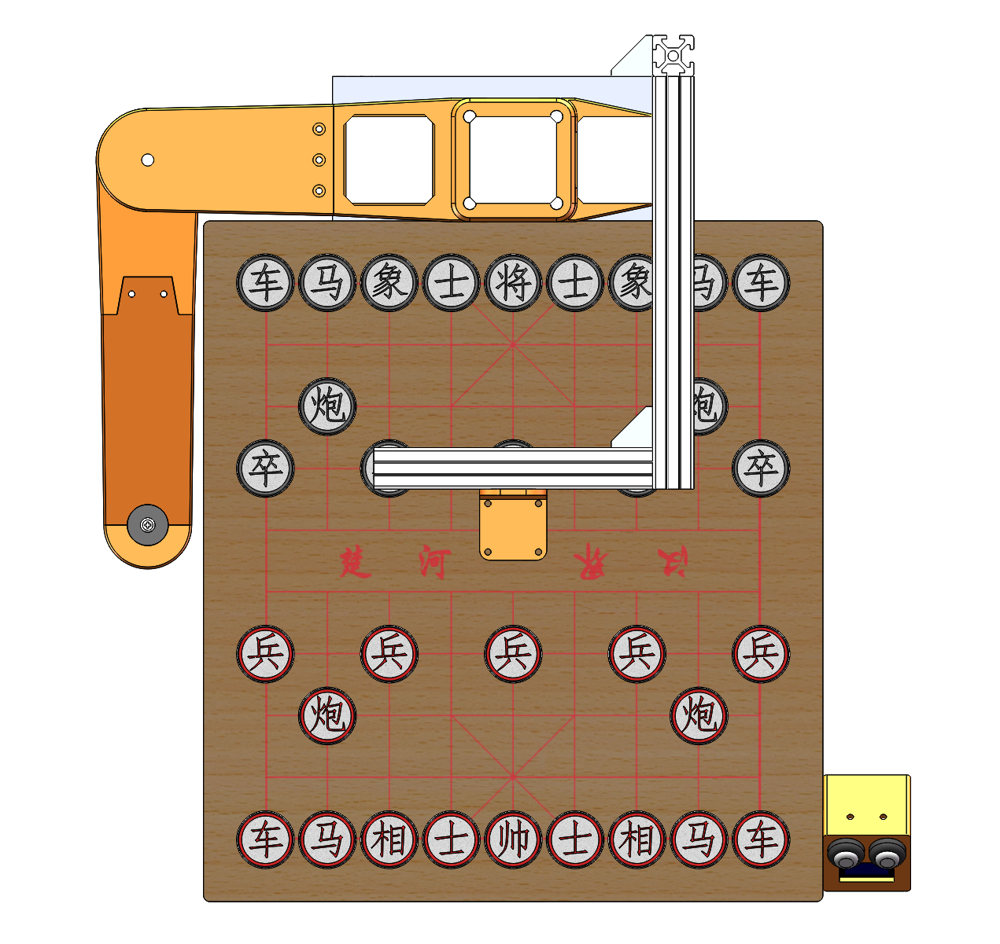
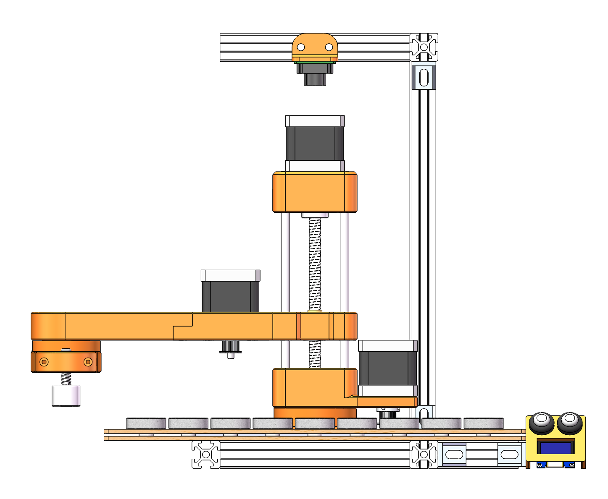
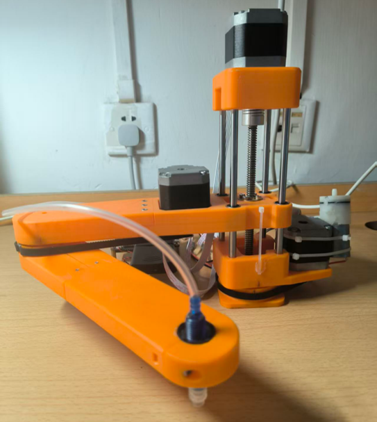
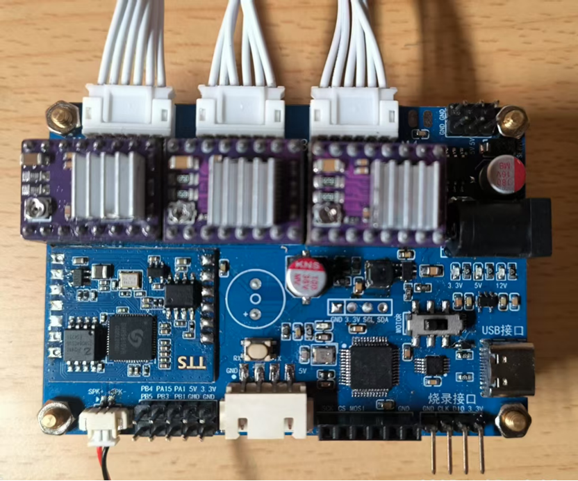
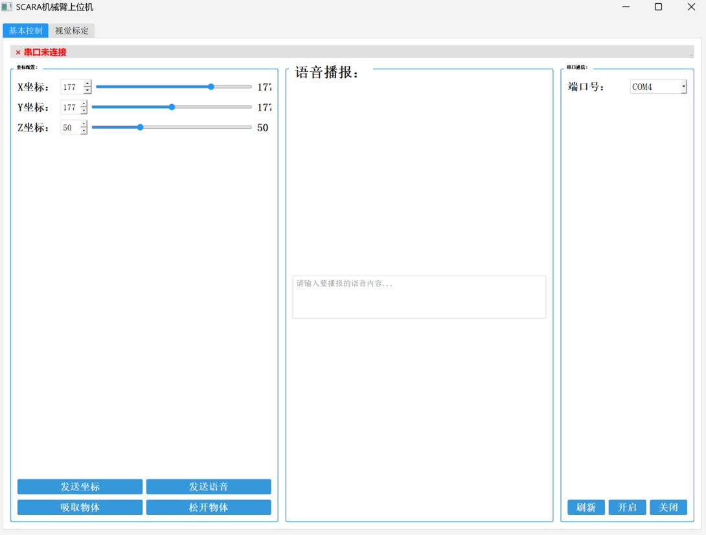
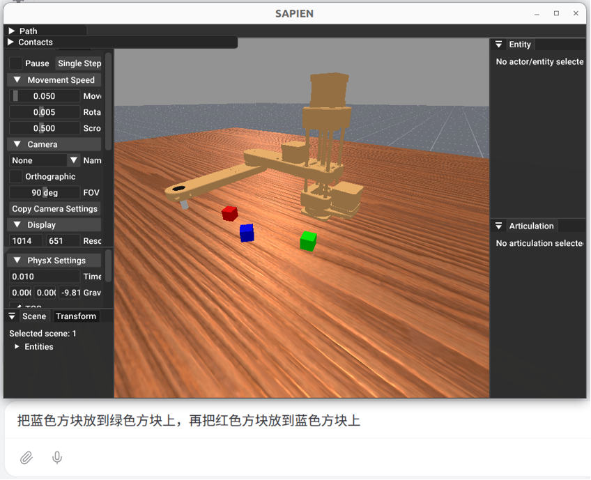

# 下棋机器人：三轴 SCARA 机械臂控制系统

本项目是下棋机器人，包含三轴 SCARA 机械臂的 STM32 下位机固件、Qt 串口上位机，以及机械结构模型和设计文档。系统支持笛卡尔坐标运动、PS2 手柄控制、末端气泵取放和语音播报。

## 项目效果图

以下为三维模型中的整机装配视图：

| 整机俯视效果 | 整机正视效果 |
| --- | --- |
|  |  |

真实照片：



驱动电路板：



上位机照片：



​	仿真照片：



## 功能概览

- **三轴 SCARA 运动控制**：下位机执行平面双连杆与 Z 轴运动学解算，将末端坐标转换为步进电机运动。
- **串口上位机控制**：通过 Qt 桌面程序选择串口、设置末端坐标、发送语音文本以及控制工具取放。
- **PS2 手柄遥控**：下位机读取手柄输入，支持直接控制机械臂末端及工具。
- **末端工具控制**：驱动气泵完成物块吸取和放下；固件配置中当前选择气泵方案。
- **语音播报**：通过串口向 SNR9816 模块发送文本。
- **机械结构与硬件资料**：提供机械臂、棋盘、PCB 等模型文件和设计笔记。

## 系统组成

| 部分 | 说明 |
| --- | --- |
| 下位机 | STM32F103C8，基于 STM32F10x 标准外设库；负责串口协议解析、运动学解算、三路步进电机、工具、PS2 和语音模块控制。 |
| 上位机 | Qt Widgets/C++ 桌面程序，使用 Qt SerialPort；提供串口连接、坐标控制、文本播报和工具控制。 |
| 机械结构 | 三轴 SCARA 机械臂，主、副臂长度参数各为 177 mm；步进电机经传动机构驱动。 |
| 驱动与供电 | 设计资料中包含 DRV8825 步进电机驱动、12 V 主电源及控制/语音模块供电方案；以实际装配和电路版本为准。 |

## 目录结构

```text
.
├── GUI/                         # Qt/C++ 上位机工程
│   ├── scara_HMI.pro             # qmake 工程文件
│   ├── mainwindow.*              # 界面与串口操作
│   └── roboticarm.*              # 上位机数据包封装
├── 下位机代码/                   # STM32 下位机工程
│   ├── Project.uvprojx            # Keil µVision 工程
│   ├── User/                      # main 与中断入口
│   ├── Hardware/                  # GPIO、串口、电机、语音等底层驱动
│   ├── Software/                  # SCARA 运动学、步进电机与协议逻辑
│   ├── Library/                   # STM32F10x 标准外设库
│   └── 通讯格式.txt               # 串口协议简表
├── URDF模型/                     # URDF 与网格模型
├── 三维模型/                     # 机械臂、棋盘及电路板等三维设计文件
└── 设计笔记/                     # 硬件与机械设计记录
```

## 构建与运行

### Qt 上位机

依赖：

- Qt 6（工程使用 C++17）
- Qt SerialPort 模块
- 与 Qt 套件匹配的 C++ 编译器（仓库现有构建目录对应 Qt 6.7.3 / MSVC 2019 64-bit Debug）

使用 Qt Creator 打开 [`GUI/scara_HMI.pro`](GUI/scara_HMI.pro)，选择已安装的桌面 Qt 套件，确认安装并启用 Qt SerialPort 后构建、运行。连接设备前，先通过界面刷新串口列表并选择端口。

上位机串口参数为 **115200 baud、8 数据位、无校验、1 停止位、无流控**。PC 与控制板之间需要使用匹配的 USB 转串口接口，并确保共地及电平兼容。

### STM32 下位机

使用 Keil MDK-ARM / µVision 打开 [`下位机代码/Project.uvprojx`](下位机代码/Project.uvprojx)。工程目标器件配置为 STM32F103C8，并依赖工程内的 STM32F10x 标准外设库。构建后按实际控制板的下载接口和时钟/引脚配置烧录固件。

上电后固件初始化电机、串口、语音模块和 PS2 手柄，并将末端坐标复位到 `X_INIT/Y_INIT/Z_INIT`。机械臂尺寸、减速比、Z 轴丝杆导程、运动范围等参数集中在 `下位机代码/Software/driver_config.h` 中；更改前请核对实际机构和驱动板配置。

> 首次联调请先断开或卸载末端工具，在安全范围内验证坐标和运动方向；坐标复位依赖当前固件设定，不等同于带限位开关的自动寻零。

## 串口协议

多字节坐标使用**大端序**传输，坐标在下位机侧按 `int16_t` 解释；校验和为指定字节求和后取低 8 位。坐标单位按固件中的机械尺寸参数以毫米配置。下列数据包均从上位机发往下位机。

| 包头 | 格式 | 校验/行为 |
| --- | --- | --- |
| `0x55` | `55 X高 X低 Y高 Y低 Z高 Z低 校验` | 校验为包头与 6 个坐标字节之和的低 8 位。下位机执行坐标移动；不可达时返回 `Target position unreachable\r\n`。 |
| `0x66` | `66 文本字节... 00` | 文本以 NUL 结尾，不带校验和。设计协议为 GBK 编码；发送端需与语音模块的字符编码保持一致。完成后返回 `Voice executed successfully\r\n`。 |
| `0x77` | `77 工具状态 校验` | `01` 吸取、`00` 放下；校验为包头与状态字节之和的低 8 位。 |
| `0x88` | `88 X高 X低 Y高 Y低 Z高 Z低 工具状态 校验` | 校验为包头及全部 7 个数据字节之和的低 8 位。依次执行工具状态变化和坐标移动；完成时返回 `Action executed successfully\r\n`，不可达时返回 `Target position unreachable\r\n`。 |

`0x55`、`0x77` 和 `0x88` 均由下位机校验后处理。上位机当前界面直接发送 `0x55`、`0x66` 和 `0x77`；`0x88` 可供兼容协议的客户端使用。

## 注意事项

- 运动范围和坐标系由固件配置及机械装配决定。更换连杆、传动比、丝杆或工具后，应重新校准参数并验证可达范围。
- 语音文本编码需与语音模块一致；Windows 上位机使用本地编码转换，跨系统运行时请特别检查字符编码。
