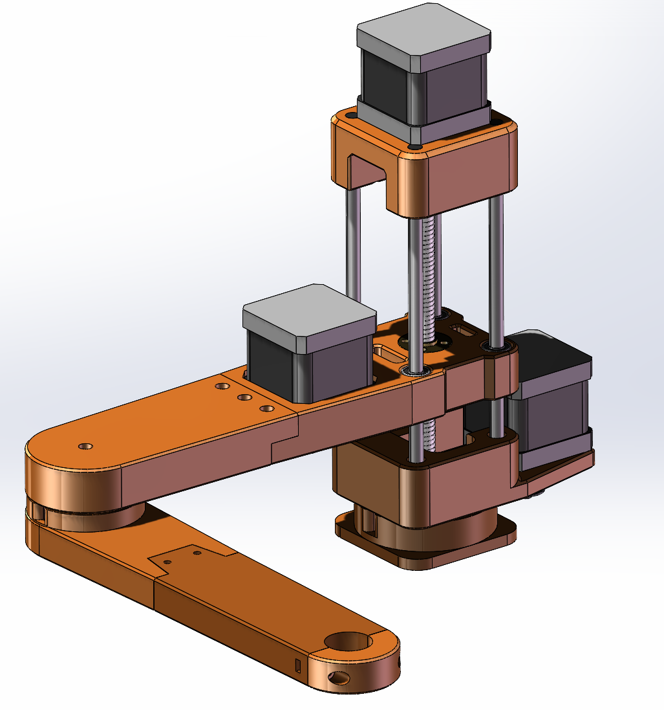
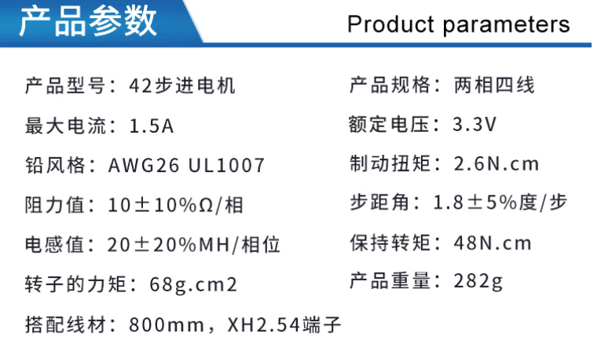
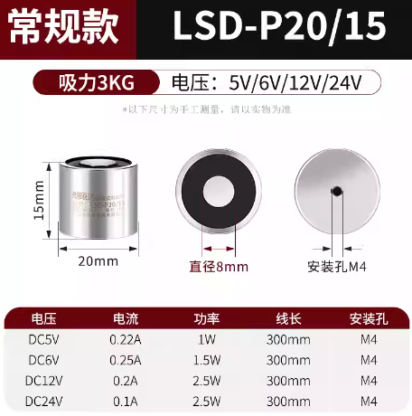
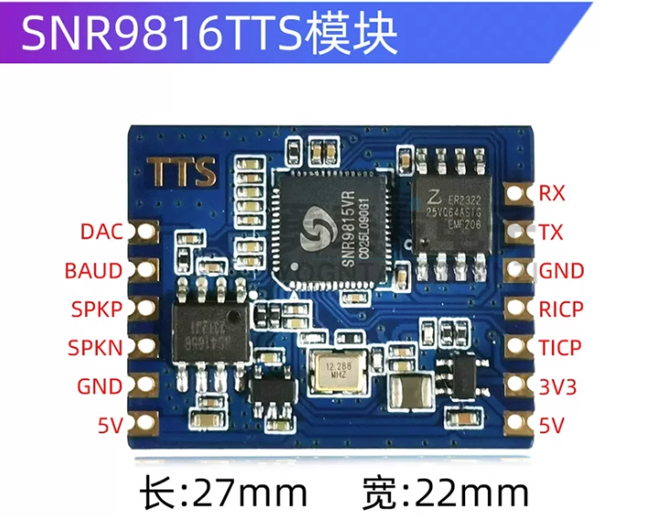
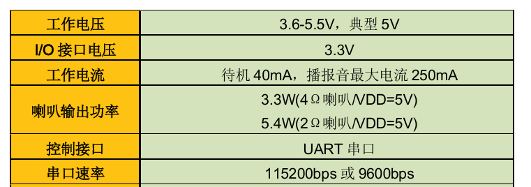
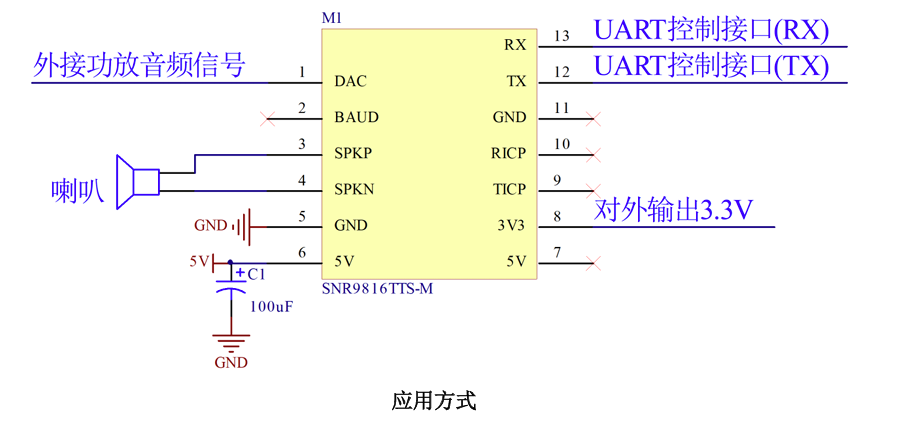
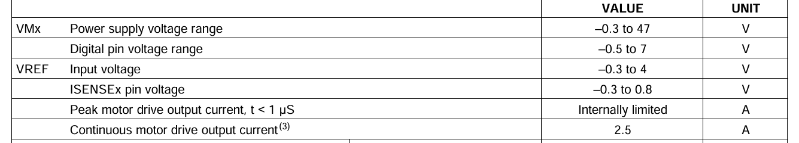
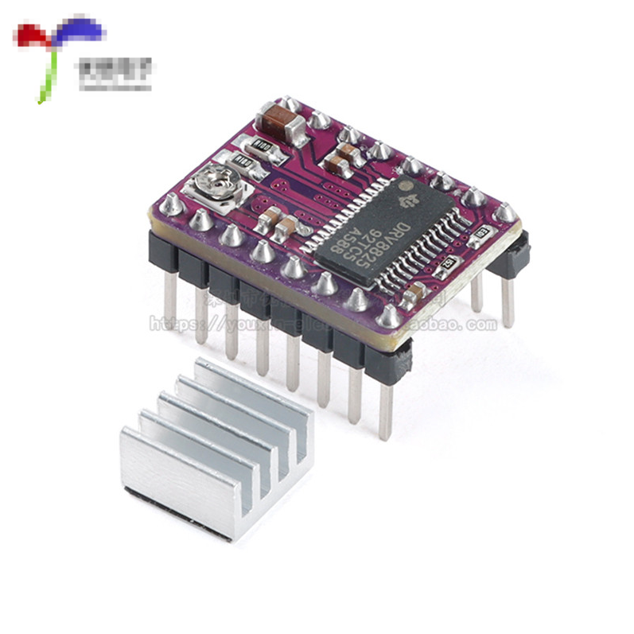
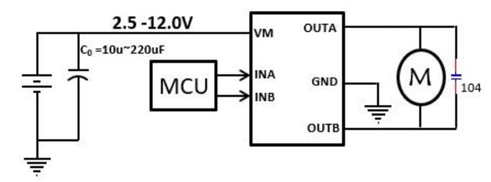
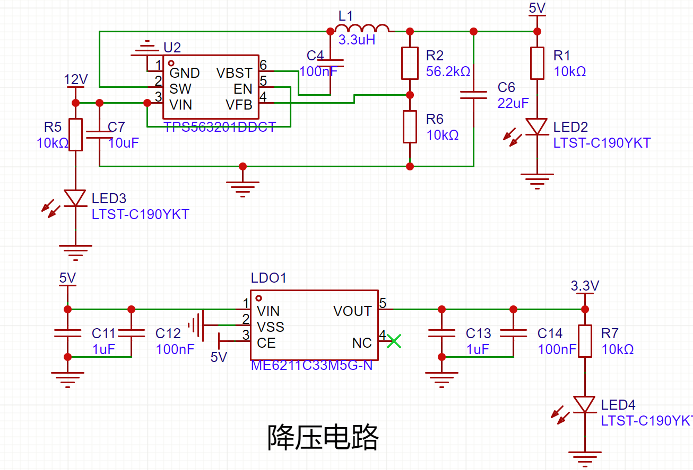

# 三轴SCARA机械臂设计笔记

## 一、机械

### 1. 机械臂



使用的机械臂是复刻了网络上开源的一个三轴SCARA机械臂（https://community.aijishu.com/a/1060000000361674），使用三个步进电机加上皮带传动驱动机械臂的运动，机械臂3D模型如上图所示。

### 2. 步进电机



这是使用的步进电机的参数，产品介绍上面写的是3.3V额定电压，然后问了厂家实际上9~36V的电机供电电压都可以。所以设计上采用常用的12V供电。

### 3. 电磁铁



使用了12V的电磁铁来吸取棋子。

但是后面发现对棋子的吸力不够而且只能吸附磁性物体。

所以后面更改了方案，使用气泵和磁通阀来实现物体的拾取。

### 4. 气泵

电磁铁只能吸取磁性物体，而且对棋子的吸力不足，因此改用气泵配合气路末端吸盘完成取放。气泵由下位机控制，取物和放物分别执行不同的输出时序。

当前固件在 `driver_config.h` 中将 `TOOL` 配置为 `AIRPUMP`。`tool.c` 使用 TIM1 的两个 PWM 通道控制气泵相关输出，PWM 频率为 50 Hz；取物和放物时切换通道的比较值，并各延时约 800 ms。气泵及阀的具体型号、气路连接方式和 PWM 比较值与实际执行器的对应关系，应以实物接线和调试结果为准。


## 二、硬件

使用语音播报，三路步进电机驱动，一路有刷电机驱动，还要有远程控制的下位机电路，所以下面考虑如何设计这个电路。

### 1. 语音模块

理论上可以使用直接像DY-SV17F这样的USB提前下载要播报语音的模块，但是打算使用SNR9816TTS模块来实现语音播报。







### 2. 步进电机驱动模块

由于电机参数上面写的是最高电流1.5A，所以采用DRV8825绰绰有余，而且比传统的A4988步进电机驱动的要好用很多。





### 3. 有刷电机驱动模块

由于只需要一路有刷电机驱动，而且电流要求较小，所以电机采用L9110S电机驱动，工作电压2.5V~12V，最大持续电流1.2A，最大电流2A满足电流需求。这是手册里给的参考电路：



### 4. 电源树

由于使用的是12V主电源供电和3.3V控制电路供电，而且语音播报模块要5V供电，所以要分别将12V降压到5V和3.3V，所以可以使用如下方案：

首先使用TPS563201这款DCDC电源芯片将电压降到5V，再通过LDO将5V电压降压到3.3V。原理图如下：




## 三、下位机控制算法

### 1. 步进电机驱动

机械臂的 FA（主臂）、SA（副臂）和 Z（垂直丝杆）轴均使用步进电机。固件将电机步距角配置为 1.8°，细分数配置为 32；驱动器接收方向信号和脉冲信号，下位机分别使用 TIM2、TIM3、TIM4 产生三轴脉冲。PWM 占空比约为 50%，通过改变定时器自动重装载值调整脉冲频率，脉冲数决定电机的目标步数。

电机初始化时将角度和速度参数换算为细分脉冲参数。每个关节的脉冲数与角度关系为：

```text
每度脉冲数 = 细分数 / 步距角
目标脉冲数 = 目标角度变化 × 每度脉冲数 × 传动比
```

FA、SA 轴分别使用 5.1 和 3.9 的传动比；Z 轴根据 2 mm 导程换算，即每转对应 2 mm 的直线位移。运动过程中，固件按目标脉冲数和设定速度规划加速、匀速及减速区间：加速与减速过程依据匀加速关系计算脉冲速度，再换算成定时器周期；短距离运动无法达到最高速度时，则缩短加减速区间。定时器更新中断负责累计已输出的脉冲，达到目标脉冲数后停止对应定时器。三轴运动分别运行，主循环等待各轴完成后结束本次坐标移动。

当前固件中 FA、SA 初始化参数为加速度 50°/s²、最高速度 30°/s、最低速度 10°/s；Z 轴电机初始化参数为加速度 80°/s²、最高速度 80°/s、最低速度 15°/s（按电机转角速度配置，再通过丝杆导程换算为直线运动）。修改这些参数前，应结合电机、驱动器电流、负载和机械传动进行实际测试。

### 2. 机械臂解算


​	这是机械臂的三个轴的定义：FA（主臂），SA（副臂），Z（垂直丝杆）

机械臂在 XY 平面内由两段连杆构成，FA 为主臂关节，SA 为副臂关节；Z 轴通过丝杆带动末端上下移动。固件参数中两段连杆长度均为 177 mm，末端坐标使用毫米表示。

上位机发送末端坐标 `(x, y, z)` 后，下位机先进行逆运动学求解。令 `L1`、`L2` 分别为两段连杆长度，`r² = x² + y²`，按当前固件采用的坐标轴和关节角定义计算：

```text
r² = x² + y²
SA = acos((L1² + L2² - r²) / (2 × L1 × L2)) × 180° / π
alpha = atan2(-y, x) × 180° / π
beta = acos((L1² + r² - L2²) / (2 × L1 × sqrt(r²))) × 180° / π
FA = 90° - alpha - beta
```

三角函数求解得到的角度换算为度数后，再与关节限位比较。当前固件配置的 FA 范围为 -90° 至 90°，SA 范围为 15° 至 180°，Z 高度范围为 2 mm 至 83 mm；超出连杆可达区域或关节限位时拒绝运动。通过检查后，下位机根据目标角度差、传动比、细分数以及 Z 轴导程计算各电机的目标脉冲数，并驱动三轴运动。

坐标初始化目前使用固件中设定的 `(177, -177, 25)`，这是程序写入的初始坐标，并非限位开关或编码器反馈得到的真实机械原点。搬运机构或机械臂时应重新确认初始姿态和坐标对应关系。

**实现注意：**逆运动学得到的关节角以度为单位；检查或使用正运动学实现时，应确认传入 `sin`/`cos` 的角度已转换为弧度，并验证关节角定义与图中的坐标轴方向一致。

## 四、物料清单

暂定


